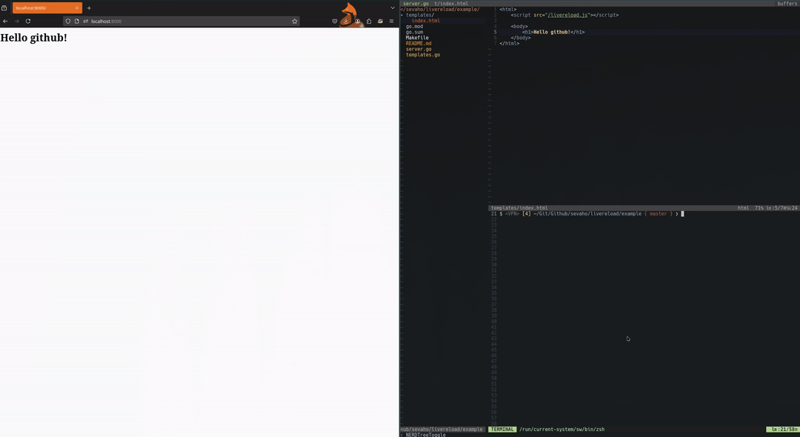

# Livereload

> Livereload your golang echo labstack web app to increase the development experience. This library only works with [echo](https://echo.labstack.com/) framework.


## Install

```
go get github.com/sevaho/livereload
```


## How to use

```golang
import (
	"github.com/labstack/echo/v4"
	"github.com/rs/zerolog/log"
)

e := echo.New()

e.Use(livereload.LiveReload(e, log.Logger, "directory A", "directory B"))
```

And add the following to every HTML file or to a `layout` html file:

```html
<script src="/livereload.js"></script>
```

## Check out the example!


